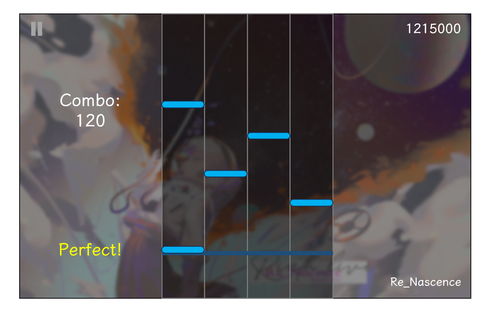

# MiniMUG 游戏简述

该游戏是一个简易的四轨道键盘交互式音游，支持键盘游玩、结果反馈与数据存储功能。

开发初期，为了简化，将规定如下内容：

* 四轨道分别对应键盘的 `D` `F` `J` `K` 按键
* 暂不支持游戏内谱面编辑功能
* 暂不支持 Hold 音符的尾判（后面会解释）
* 暂不支持双押和多押（后面会解释）
* 暂不开发 Settings 页面和 About 页面

## 游玩方法

在正式游玩界面，并排放置着四个轨道。

轨道在特定的时间戳（timestamp）会下落对应的音符。音符分为单击（Tap）音符和长按（Hold）音符。

玩家需要在音符对应的时间戳按下对应轨道的键盘按键，以此来获得连击分（combo）和分数（score）。

## 计分方式

### 判定

谱面文件会记录所有的音符对应的时间戳，其中 Tap 音符记录击打的时间戳，Hold 音符记录开始按下和松开的时间这两个时间戳。在某个音符的时间戳即将到来时：

对于 Tap 音符（单点）：

* 如果用户**在正确的轨道上**击打并且击打的时间戳与标准时间戳相差**不超过 80ms**（早或晚 80ms 范围内）记为**完美（Perfect）**。

* 如果用户**在正确的轨道上**击打并且击打的时间戳与标准时间戳相差**超过 80ms**（早或晚 80ms 范围外），但**不超过 120ms**（早或晚 120ms 范围内）记为**良好（Good）**。

* 上述两个条件不满足的情况下（也就是说击打时间戳超过 120ms 或是击打了错误的轨道），记为**失误（Miss）**。

对于 Hold 音符（长条）：

* 分为开始按下的判定（**头判**）和松开的判定（**尾判**）。在这里我们**先不考虑尾判**，于是 Hold 音符的判定就和 Tap 音符的基本判定规则是一样的。
* 同时 Hold 音符会有一个松开时间。这里规定：**头判有效并且在松开时间到来或之后松开视为有效击打**，如果松开时间之前就松开了按键，无论头判如何都视为 Miss。

*这里假设音符之间不会同时落下（也即不考虑双押、多押）。*

### Combo：连击数

* 一个 Tap 或一个 Hold 都记作一个连击。
* Combo 会在游玩过程中实时出现。如果 Combo 数量为 0 或 1 或 2，不在界面中显示。当 Combo 数量达到 3（也就是说连续**有效**击打了三个音符及以上，可以是 Perfect 也可以是 Good）的时候，Combo 数会在游玩界面中实时更新。一旦用户未击打音符（Miss），Combo 数量清零。

此过程持续至乐曲结束。

### Score：分数

每首乐曲有一个游玩分数。简单起见，每一首乐曲的总分**满分**：

    满分 = 物量总数 * 100

这里的**物量**就是乐曲的所有单点和长条音符加起来的总数。

容易理解，得到满分的充要条件是**每一个音符都为 Perfect 判定**。也就是说，当一个音符为 Perfect 判定的时候，总分 += 100。

对于每一个音符：

* 如果是 Good 判定，总分 += 75。
* 如果是 Miss 判定，总分 += 0。

## 显示内容

把该游戏分为以下几个界面：

* 欢迎界面
* 选歌界面
* 游玩界面
* 暂停界面
* 结算界面

### 欢迎界面

欢迎页面在框架中已经设计好，作为入口界面。显示背景、游戏标题、游戏介绍与三个按钮。三个按钮分别为 Play、Settings 和 About。后两个页面在早期先不开发。

可以在欢迎页面循环播放背景音乐。

### 选歌界面

在欢迎页面中点击 Play 即进入选歌界面。游戏在此时读取工程中的特定目录（待定），从中获取歌曲的标题、作者和封面信息（待定）。可以通过鼠标点击按钮的方式进行选歌。

界面右下角会有一个 Start 按钮，点击即可开始对应乐曲的游玩。

此外还有一个退出按钮回到欢迎页面。

### 游玩界面

游玩界面如下：

左上角为暂停按键，右上角实时显示分数，右下角显示歌曲名称，背景为歌曲封面。

左边显示连击数和当前音符判定。

中间是四个轨道，下面的深蓝色线为不动的判定线。当音符的按下时间戳到来时，对应的音符**应该和判定线重合**。

### 暂停界面

当玩家按下 `Q` 按键或是鼠标点击左上角的暂停按钮，进入暂停界面。暂停界面很简单，提供两个按钮，分别是退出和继续。退出按键按下时，回到选歌界面；继续按键按下时，继续乐曲的播放和游玩。

### 结算界面

当乐曲游玩结束时，进入结算界面。结算界面可以展示如下信息：

* Rank: 评级。分数为满分，评级为 X；不到满分但是达到满分的 95%，评级为 S；不到 95% 但是到 90%，评级为 A；不到 90% 但是到 80%，评级为 B；80% 以下为 C。
* Max Combo：最大连击数。显示整个游玩过程中 Combo 出现过的最大值。
* Accuracy：准确率（简称 acc），计算 Perfect 数量除以总物量。
* Count：统计多少个 Perfect，多少个 Good 和多少个 Miss。

结算界面有一个退出按钮，可以回到选歌界面。